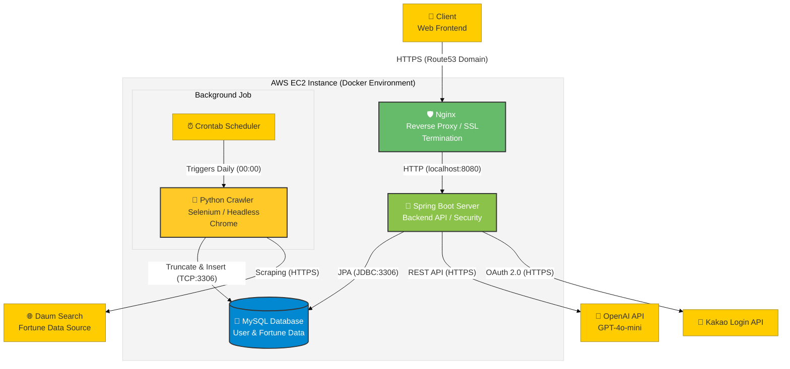

# Fortune Card Collection - BE

> **"오늘의 운세를 AI가 해석해주는 나만의 운세 카드 서비스"** > 별자리 별 운세 및 ChatGPT ai를 통한 개인 맞춤형 운세 제공, 그리고 오늘의 명언을 사용장자에게 제공합니다.

 

## 소개
이 프로젝트는 별자리 별 운세 데이터를 자동으로 수집하고 자정마다 crontab을 이용해 서버를 갱신하며, 사용자에게 ChatGPT ai 기반의 맞춤형 운세 카드를 제공하는 백엔드 서버입니다.
**AWS EC2** 환경에 배포되었으며, **Docker**와 **Nginx**를 활용하여 **HTTPS** 환경을 구축했습니다.

### 개발 기간
* 2024.10.31 ~ 2024.12.18

 

## 기술 스택

### Backend
* **Java 17**
* **Spring Boot 4.4.0**
* **Spring Security**
* **Spring Data JPA**
* **Gradle**

### Database & Infra
* **MySQL 8.0**
* **AWS EC2** (Ubuntu)
* **Docker / Docker Compose**
* **Nginx** (Reverse Proxy & SSL)

### AI & External API
* **OpenAI API** (GPT-4o-mini)
* **Kakao Login API** (OAuth 2.0)

### Data Collection (Crawler)
* **Python 3.12.3**
* **Selenium**
* **Crontab** (자동화 스케줄링)

